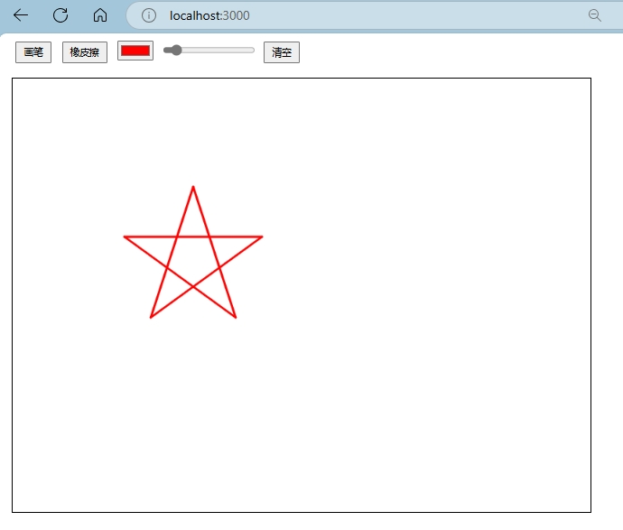

# MCP-painter
这是一个基于MCP协议编写的绘图工具示例项目，支持画笔工具和绘图结果获取功能。
提供了一个完整的MCP-server应用示例，可用于测试和学习MCP协议的使用。

## 画板功能介绍

- 画笔工具：支持设置画笔线宽和颜色
- 绘图结果获取：支持以PNG格式获取当前画布图像
- 可视化：画图程序的服务端和前端之间使用websocket通信,前端可实时查看调用api接口后绘图操作的结果（可视化）。
- mcp-painter使用服务端提供api接口编写工具。

## 运行方式

应用运行
```
cd whiteBoard
npm install
npm run dev
```
查看localhost:3000,即可看到画板页面。
### 接口测试
运行 draw_start.py
```
python draw_start.py
```
可以看到以下结果



## 白板程序的mcp-server使用说明
编译mcp-painter(server)
```
cd mcp-painter
npm install
npm run build
```
在cline，claude-desktop等支持mcp协议的客户端添加mcp-painter即可。由于环境问题，我直接使用nodejs运行。
```
"DrawingBoard": {
      "command": "yournodepath/node.exe",
      "args": [
        "yourpathto/mcppainter/build/index.js"
      ],
      "env": {},
      "disabled": false,
      "autoApprove": [
        "set_brush",
        "use_eraser",
        "draw_on_canvas",
        "set_color",
        "get_image",
        "clear_canvas",
        "get_canvas_size",
        "set_canvas_size",
        "get_current_draw_parameters"
      ]
    }
```

## MCP协议编写工具说明

### 1. 画笔工具封装
- 封装了画笔的线宽和颜色设置功能
- 通过MCP协议暴露以下接口：
  - 设置画笔线宽
  - 设置画笔颜色
  - 获取当前画笔配置

### 2. 绘图结果获取
- 封装了画布图像获取功能
- 支持以PNG格式返回绘图结果
- 通过MCP协议暴露以下接口：
  - 获取当前画布图像
  - 获取画布尺寸信息

## 接口说明

### 1. 画笔相关接口
- `POST /brush`：设置画笔属性
  - 参数：`width`（线宽）, `color`（颜色）
  - 示例：`{"width": 3, "color": "#ff0000"}`

- `POST /eraser`：设置橡皮擦属性
  - 参数：`width`（线宽）
  - 示例：`{"width": 10}`

### 2. 绘图操作接口
- `POST /draw`：执行绘图操作
  - 参数：`x`, `y`, `state`
  - 示例：`{"x": 100, "y": 200, "state": 'start'}`
  - state: `start`,`move`,`end`

### 3. 颜色选择器接口
- `POST /color-picker`：设置颜色
  - 参数：`color`（颜色值）
  - 示例：`{"color": "#00ff00"}`

### 4. 画布操作接口
- `POST /clear`：清空画布
- `POST /set_canvas_size`：设置画布尺寸
  - 参数：`width`, `height`
  - 示例：`{"width": 800, "height": 600}`
- `GET /get_canvas_size`：获取画布尺寸
- `GET /get_current_draw_parameters`：获取当前绘图参数

### 5. 图像获取接口
- `GET /image`：获取当前画布图像
  - 返回：PNG格式图像base64数据
